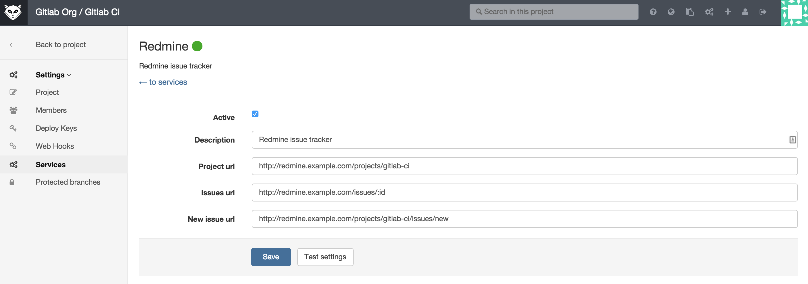

# External issue tracker

GitLab has a great issue tracker but you can also use an external issue tracker such as Jira, Bugzilla or Redmine. You can configure issue trackers per GitLab project. For instance, if you configure Jira it allows you to do the following:

- the 'Issues' link on the GitLab project pages takes you to the appropriate Jira issue index;
- clicking 'New issue' on the project dashboard creates a new Jira issue;
- To reference Jira issue PROJECT-1234 in comments, use syntax PROJECT-1234. Commit messages get turned into HTML links to the corresponding Jira issue.

## Configuration

### Project Service

You can enable an external issue tracker per project. As an example, we will configure `Redmine` for project named gitlab-ci.

Fill in the required details on the page:

* `description` A name for the issue tracker (to differentiate between instances, for example).
* `project_url` The URL to the project in Redmine which is being linked to this GitLab project.
* `issues_url` The URL to the issue in Redmine project that is linked to this GitLab project. Note that the `issues_url` requires `:id` in the url. This id is used by GitLab as a placeholder to replace the issue number.
* `new_issue_url` This is the URL to create a new issue in Redmine for the project linked to this GitLab project.

### Service Template

It is necessary to configure the external issue tracker per project, because project specific details are needed for the integration with GitLab.
The admin can add a service template that sets a default for each project. This makes it much easier to configure individual projects.

In GitLab Admin section, navigate to `Service Templates` and choose the service template you want to create:

After the template is created, the template details will be pre-filled on the project service page.

Support to add your commits to the Jira ticket automatically is [available in GitLab EE](http://doc.gitlab.com/ee/integration/jira.html).
