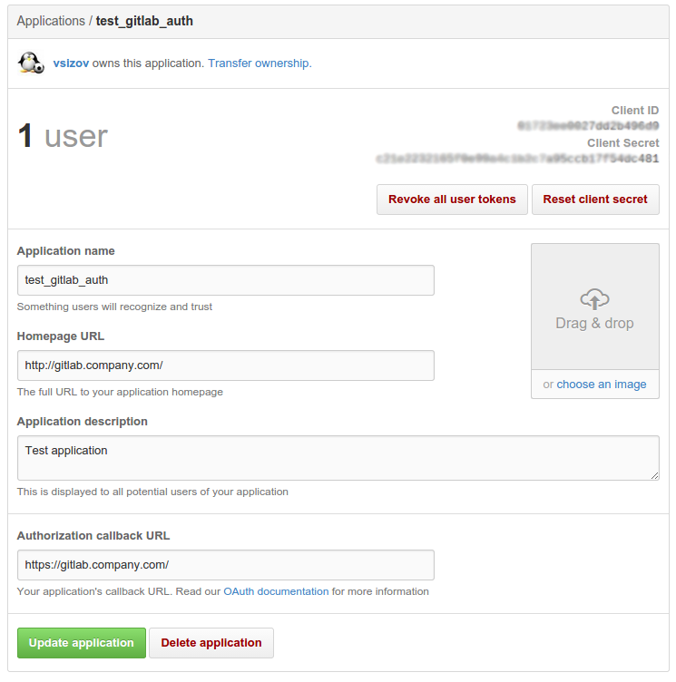

# GitLab OAuth2 OmniAuth Provider

To enable the GitLab OmniAuth provider you must register your application with GitLab. GitLab will generate a client ID and secret key for you to use.

1.  Sign in to GitLab.

1.  Navigate to your settings.

1.  Select "Applications" in the left menu.

1.  Select "New application".

1.  Provide the required details.
    - Name: This can be anything. Consider something like "\<Organization\>'s GitLab" or "\<Your Name\>'s GitLab" or something else descriptive.
    - Redirect URI:

    ```
    http://gitlab.example.com/import/gitlab/callback
    http://gitlab.example.com/users/auth/gitlab/callback
    ```

    The first link is required for the importer and second for the authorization.

1.  Select "Submit".

1.  You should now see a Application ID and Secret. Keep this page open as you continue configuration.

1.  You should now see a Client ID and Client Secret near the top right of the page (see screenshot). Keep this page open as you continue configuration. 

1.  On your GitLab server, open the configuration file.

    For omnibus package:

    ```sh
      sudo editor /etc/gitlab/gitlab.rb
    ```

    For instalations from source:

    ```sh
      cd /home/git/gitlab

      sudo -u git -H editor config/gitlab.yml
    ```

1.  See [Initial OmniAuth Configuration](README.md#initial-omniauth-configuration) for inital settings.

1.  Add the provider configuration:

    For omnibus package:

    ```ruby
      gitlab_rails['omniauth_providers'] = [
        {
          "name" => "gitlab",
          "app_id" => "YOUR APP ID",
          "app_secret" => "YOUR APP SECRET",
          "args" => { "scope" => "api" } }
        }
      ]
    ```

    For installations from source:

    ```
      - { name: 'gitlab', app_id: 'YOUR APP ID',
        app_secret: 'YOUR APP SECRET',
        args: { scope: 'api' } }
    ```

1.  Change 'YOUR APP ID' to the Application ID from the GitLab application page.

1.  Change 'YOUR APP SECRET' to the secret from the GitLab application page.

1.  Save the configuration file.

1.  Restart GitLab for the changes to take effect.

On the sign in page there should now be a GitLab icon below the regular sign in form. Click the icon to begin the authentication process. GitLab will ask the user to sign in and authorize the GitLab application. If everything goes well the user will be returned to your GitLab instance and will be signed in.
